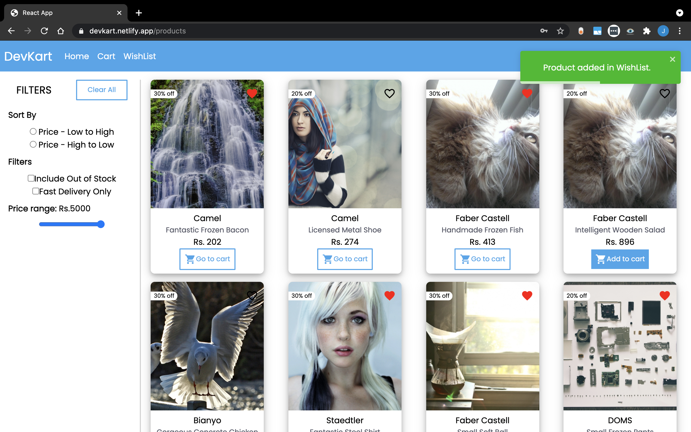

# DevKart

E-Commerce Shopping Application

## Features

-   Login/SignUp
-   Cart Management
-   Wishlist Management

## Run Locally

Clone the project

```bash
  git clone https://github.com/JatinRanka/DevKart-Frontend.git
```

Go to the project directory

```bash
  cd DevKart-Frontend
```

Install dependencies

```bash
  npm install
```

Start the server

```bash
  npm run start
```

## Demo

### Products page



### Cart Page


